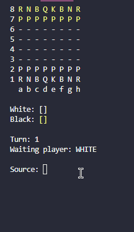

## Chess System on Java

This Chess System is a chess game created on console application on Java language when learning oop in a course.

## Features

This project features a chess match rendered on console application (on tests the Git Bash console was used, but when using PowerShell the results were the same). The board is represented using a bidimensional array, and programming logic was used to create chess pieces on that board, along with methods to interact with those pieces.

Each piece has a logic to demonstrate on the array which position it can move, and the possible moving target position should also have its background color changed when you select a source piece.

You can also do special moves, like en passant, promotion, or the rook move.
Chess rules are also respected. Turns are registered and also the console displays which player, the one commanding white or black pieces, it is waiting a move from.

## How to play

You can interact with those pieces solely using the board coordinates, represented by a letter and a number. So, for example, when performing a move, you select a source piece, and a target location, to execute the command.

